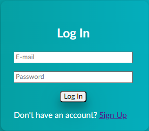

# About
<p align="center">
    
</p>

A RESTful API simulating a Login Page written in Python using the Flask Framework to handle HTML routing, in addition to storing created users in a database created using MariaDB

## Prerequisites
1. Python **(3.11 ) HIGHLY RECOMMENDED**
2. MariaDB Connector for Python
    - A C compiler, preferably GCC
    - OpenSSl
3. Windows Subsystem for Linux


## Installation
**Please note that this RESTful with the Prerequisites installed in WSL. The installation methods for Windows or Powershell may vary**

1. First you must install a C compiler, for instructions purposes, install GCC via the command:
``` console
$ sudo apt install gcc
```

2. Then install the MariaDB connector for Python using this command
``` console
$ sudo apt install python3-dev
```


### TODO:
- [ ] Implement admin authentications (Not Essential)


